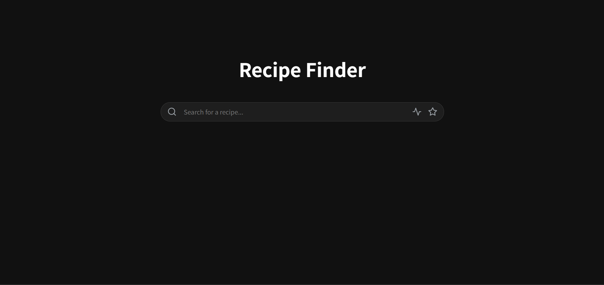

# 🍳 Recipe Finder (레시피 검색기)

TheMealDB API를 활용하여 원하는 레시피를 검색하고 관리할 수 있는 웹 애플리케이션.

 

*(실제 프로젝트 스크린샷)*

 

## ✨ 주요 기능

- **레시피 검색**: 키워드를 통해 원하는 레시피 검색 기능
- **결과 표시**: 검색 결과를 카드 형태의 그리드 레이아웃으로 표시
- **즐겨찾기**: `localStorage`를 이용한 즐겨찾기 추가/삭제 및 데이터 영속성 유지
- **즐겨찾기 모아보기**: 즐겨찾기한 레시피만 모아서 보는 기능
- **링크 공유**: Web Share API 또는 클립보드 복사를 통한 레시피 링크 공유
- **실시간 피드백**: 로딩 스피너 및 에러 메시지를 통한 사용자 경험(UX) 개선
- **반응형 디자인**: 모바일 환경에서도 최적화된 화면 제공

 

## 🛠️ 기술 스택

- **HTML**
- **CSS**
  - Flexbox & Grid 레이아웃
  - 반응형 디자인 (Media Queries)
  - Keyframe 애니메이션
- **JavaScript (ES6+)**
  - `async/await`를 활용한 비동기 API 통신 (Fetch API)
  - DOM 조작
  - `localStorage`를 이용한 데이터 관리
  - Web Share API

 

